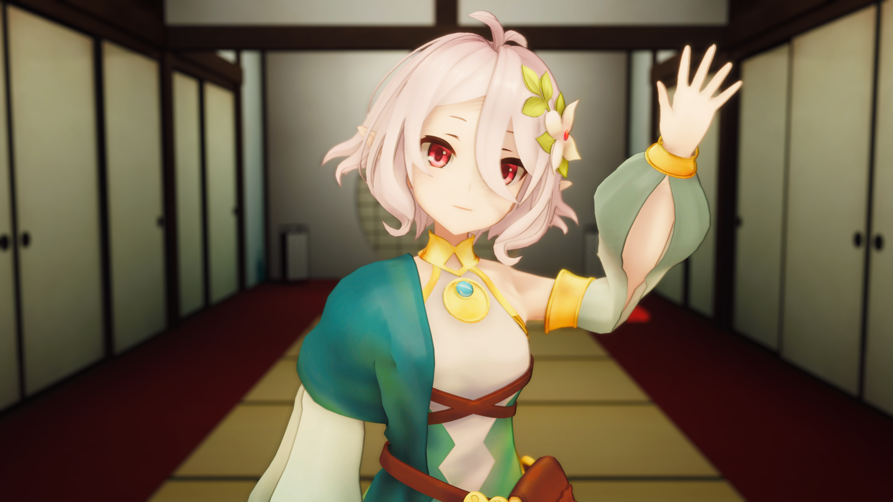
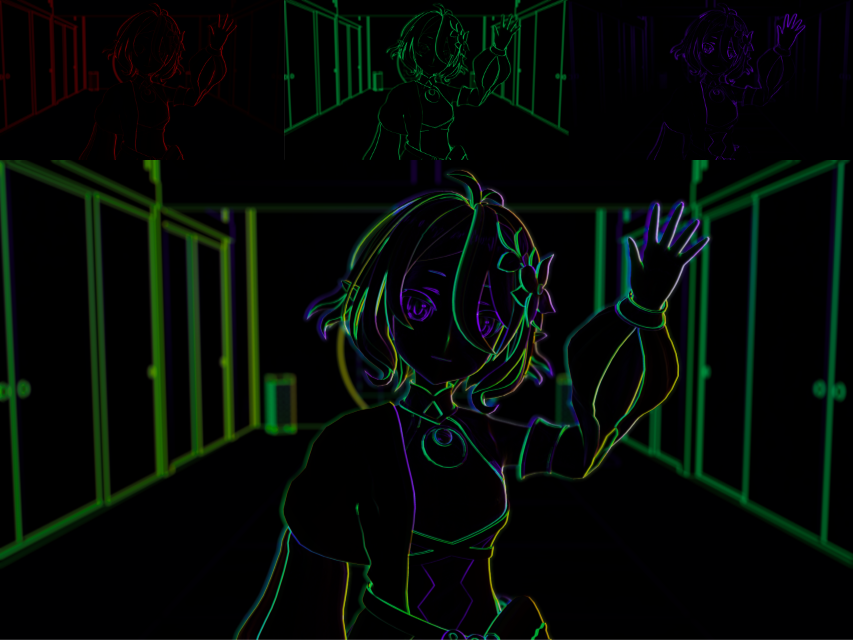
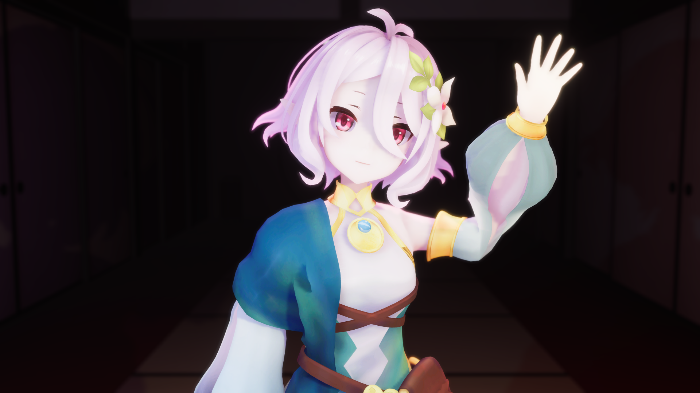
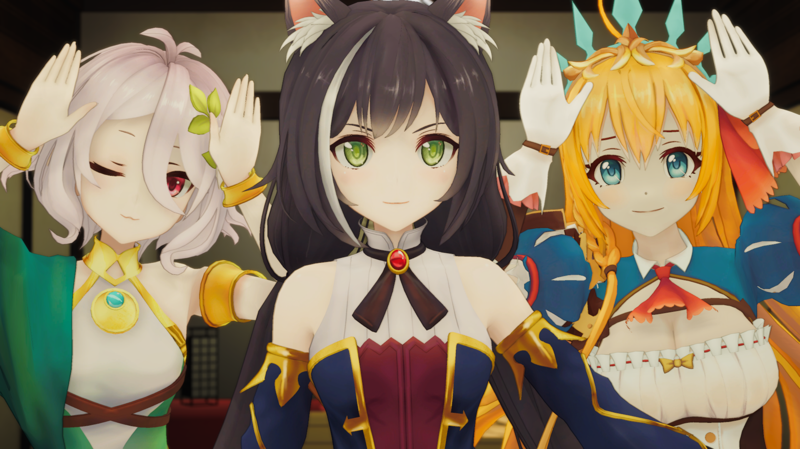
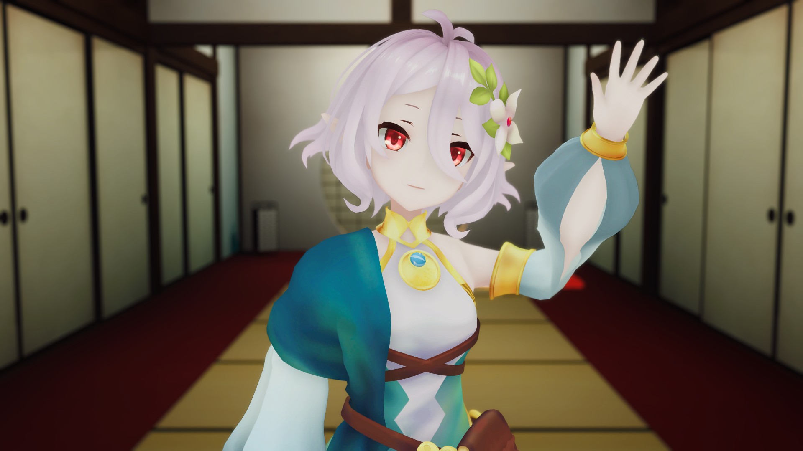
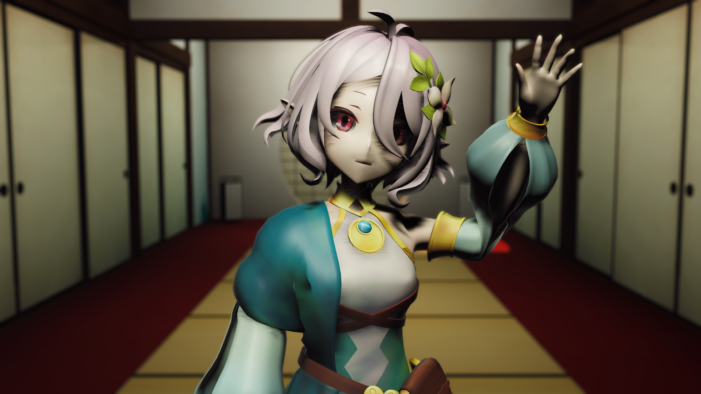

<h1 align="center">
	
	 
	Anime-Style Cel Shader (Unity)
</h1>

	
	
	
	

## Details
This project allows for anime-style cel-shading in Unity. It includes lighting, shadows, edges, and is highly configurable. Adjusting the material settings might be necessary depending on the model, scene, or desired art-style.

Edges are blended with a custom render feature and pass using the camera's depth, normals, and color which contribute to the weight of the edge. Each contribution can be fine-tuned or disabled completely in the render feature's settings.

### Sidenote
Physically based rendering of anime-style models is an inaccurate representation of how anime is drawn or rendered. While unlit shaders are more of an accurate representation, they often lack the artistic beauty that scene lighting provides. This shader simulates lighting and shadows more akin to the artistic style of anime while providing the options to allow for further freedom to the artist. Edges provide a subtle distinction between flat surfaces and can vary depending on the artistic style.

## Usage

* Add the repository to your URP project.

### Materials
* Assign the `Anime/Lit` shader to a material for your character or level.
* Configure or use the default settings.

### Edges
* Select your render pipeline's asset renderer.
	* Asset in `Project Settings/Quality/Render Pipeline Asset`.
	* The renderer is in the asset, under `Renderer List`.
* Click `Add Renderer Feature` at the bottom of the asset.
* Add `Edge Detection`.
* Configure or use the default settings.

## Compatibility

Requires Unity's [Universal Render Pipeline (URP)](https://docs.unity3d.com/Packages/com.unity.render-pipelines.universal@13.1/manual/) with Unity version `2022.1.0b10` or greater for full compatibility.

Requires Unity version `2022.1.0b10` or higher for full functionality.

| Feature | Supported |
| - | :-: |
| Post Processing | ✅ |
| Deferred Rendering | ✅ |
| Accurate G-Buffer Normals | ✅ |
| Forward Rendering | ✅ |
| Orthographic Cameras | ✅ |
| Perspective Cameras | ✅ |
| Pixel Lights | ✅ |
| Vertex Lights | ✅ |
| Decals | ✅ |
| Virtual Reality | ✅ |

## Lighting

Each material has configurable settings to modify how lighting behaves on the model.

| Property | Recommended | Description |
| - | - | - |
| Shade Min | -0.5 to -1.0 | Light areas are more aggressive with higher values. |
| Shade Max | 0.0 to 0.5 | Dark areas are more aggressive with higher values. |
| Shade Falloff | 0.0 to 0.5 | Higher values result in more aggressive directional lighting which looks bad. While lower values have the opposite effect and make them look better. |
| Vertex Light Falloff | 0.25 to 0.5 | Same as the **shade falloff** setting, but for vertex lights (if enabled). |
| Shadow Color | Greyish | A light's indirect light which is applied to shadowed areas. |
| Receive Shadows | On | Enable shadows applied to the model. |
| Shadow Falloff | 1.0 to 2.0 | Higher values result in harder shadows. |
| Alternate Shadows | Off | Uses an inverse lighting falloff, which softens shadows. |

Examples of the differences of: [Vertex Lighting](.Images/VertexLitSmall.png) and [Pixel Lighting](.Images/PixelLitSmall.png).

A project's settings or a scene's lighting can greatly effect the result of the shader in positive and negative ways.

## Edges

Edges are enabled as a feature in the render pipeline asset's renderer.

| Setting | Recommended | Description |
| - | - | - |
| Visualize | - | Render just the edges. Each contribution method is split into their own channel. Disable post-processing for an accurate representation. |
| Color | - | Color that the edge blends with. Alpha channel is used for opacity. |
| Blend Mode | - | How the outline blends with the image. |
| Quality | Low or Medium | How many samples are take to determine the edge. |
| Size | 1.0 to 2.0 | How many pixels the edge is. |
| Depth | 0.02 to 0.1 | How much differences in depth contributes to the edge intensity, in meters. |
| Coplanar Falloff | 0.5 | Scales depth falloff to avoid contributing coplanar pixels with high deltas. Typically reproducible by looking parallel at a face. |
| Normal Falloff | 1.0 | Scales normals contribution. Higher values for higher angles. Zero to disable. |
| Depth Falloff | 0.5 | Scales depth contribution using the **depth** setting. Higher values will scale depth factor up. Zero to disable. |
| Color Falloff | 1.5 | Scales color contribution. Higher values for more aggressive color thresholds. |

The visualizer shows each channel combined.

| Channel | Contributor |
| - | - |
| Red | Depth |
| Green | Normals |
| Blue | Color |

 

## Videos

None.

## Images

**As of version 0.1.0.**

*Inside*

*Outside*

*3-Point Setup*

*Lit Group*

## Comparisons

URP's Unlit

URP's Lit

## Credits

* Inspiration and ideas from Colin Leung (NiloCat)'s [UnityURPToonLitShaderExample](https://github.com/ColinLeung-NiloCat/UnityURPToonLitShaderExample).
* Re:Dive models from [https://i-fox.club/pcr/](https://i-fox.club/pcr/) and group pose for comparison.
* Unity Technologies for [referencing the URP](https://github.com/Unity-Technologies/Graphics).

## License

This project is licensed under the MIT License. Credit is appreciated.
